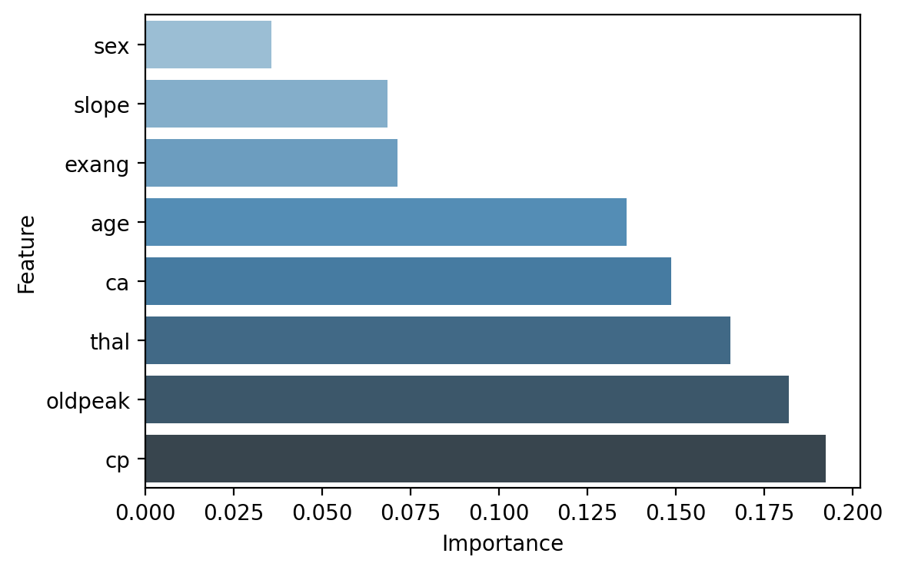
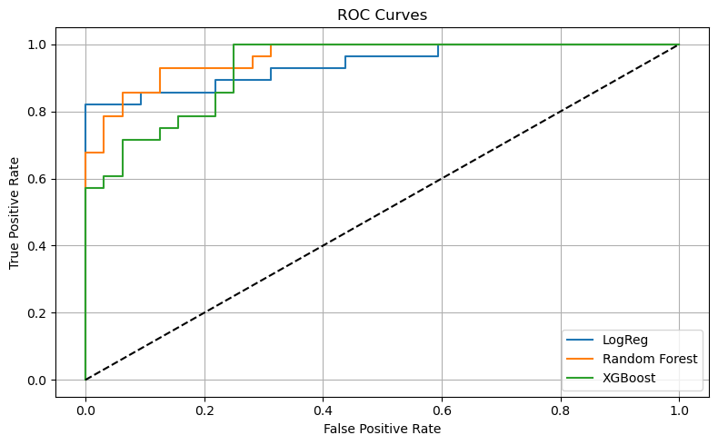

# Heart Disease Clinical Prediction App

> **Disclaimer:**  
> This application is intended strictly for **clinical use only**. Inputs such as Thalassemia, ST Depression, and Number of Major Vessels require medical tests and cannot be self-diagnosed by general users.

---

  
  
  
  
  
  
  

## Overview

This web application predicts the likelihood of heart disease based on clinical input parameters using machine learning models. It allows medical practitioners to manage multiple patients, input data interactively, and receive instant predictions with explanations.

Built using **Streamlit**, this tool offers accessibility, speed, and usability for clinical decision-making support.

---

## Live Demo

[Click here to access the deployed Streamlit app]([https://heart-disease-streamlit-demo.streamlit.app](https://heart-condition-prediction-94atfwwmnjkthnywacchmm.streamlit.app/))

---
## Application Preview

<u>**Patient Form Input Interface**</u>  

<u>**Click on Add Patients to add patient details**</u>  

<u>**High Risk**</u>  

---
## Features

- Add multiple patients via dynamic sidebar form.
- Save and search patient records.
- Input clinical features like chest pain type, ST depression, thalassemia, etc.
- View prediction results with model confidence.
- Visualize model feature importance.
- Display model comparison and ROC Curve for transparency.

---

## Input Features Used in Prediction

| Feature     | Description                                              |
|-------------|----------------------------------------------------------|
| `age`       | Age (used in model)                                      |
| `sex`       | Biological sex (0 = Female, 1 = Male)                     |
| `cp`        | Chest pain type (categorical: 0–3)                        |
| `exang`     | Exercise-induced angina (0 = No, 1 = Yes)                |
| `oldpeak`   | ST depression induced by exercise                        |
| `slope`     | Slope of peak exercise ST segment                        |
| `ca`        | Number of major vessels colored (0–3)                    |
| `thal`      | Thalassemia (0 = normal, 1 = fixed defect, 2 = reversible defect) |

> Patient Name, ID, and Personal Age are stored only for record-keeping and are **not used** in model training or prediction.

  <strong>Model Insights</strong> 
  

---

## Model Performance and Selection

We trained and evaluated three different machine learning models. Based on ROC AUC scores, **Random Forest** performed the best and was selected for deployment.

| Model                 | ROC AUC Score       | Selected |
|-----------------------|---------------------|----------|
| Random Forest         | **0.9621**           | Yes   |
| Logistic Regression   | 0.9408               | No       |
| XGBoost Classifier    | 0.9308               | No       |

---

## ROC Curve Comparison

---
## Final Note

>This project is a demonstration of how machine learning models can be deployed using interactive web applications to assist in medical decision-making. While the model performs well on historical clinical data, it should not replace expert medical judgment. Continuous monitoring, retraining on updated data, and ethical deployment practices are recommended.
